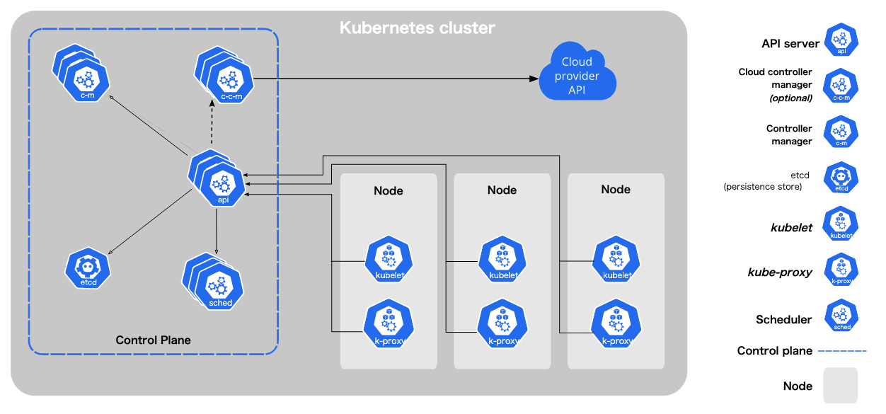

- controller
  - get information from objects
  - sent them to the k8s (control plane)
  - then k8s (control plane) keep objects to the right status
  - one controller one object's aspect,never delete objects created by other controller
  
- objects
  - persistent entity in k8s system . souch as
    - node
    - job
    - pod
    - container
    - image
    - service
    - deployment
  - object spec and status.
  - use yaml to describe. ( kubectl apply -f xxx.yaml)
  